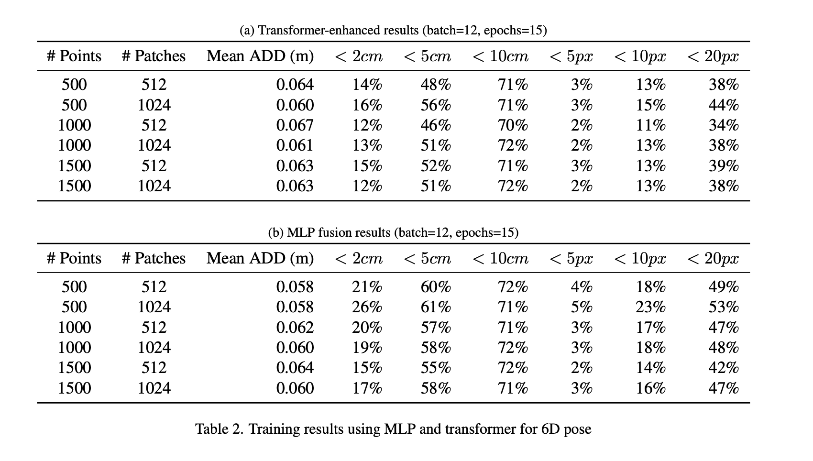

## Results Table (Transformer vs MLP)

Please place the results image at `docs/results_table.png` (or update the path below if you prefer).

Figure: Training results table (Mean ADD, success rates) comparing Transformer and MLP fusion.

Notes:
- If you want the image embedded directly in `README.md`, move `docs/results_table.png` into the repo and I can patch `README.md` to reference it directly.
- To add the image file, upload the PNG to `docs/results_table.png`, then commit and push.
